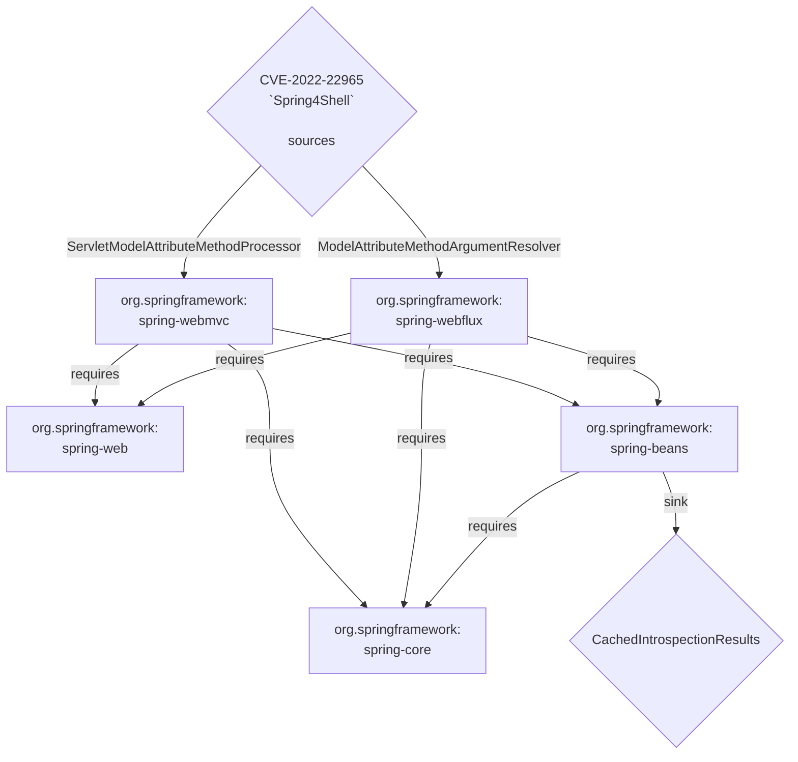
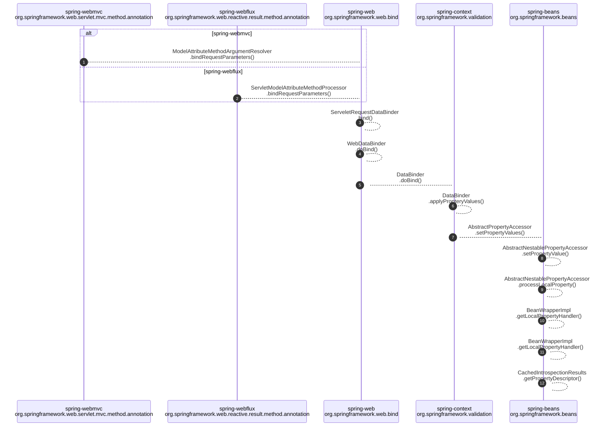

# CVE-2022-22965 "Spring4Shell" Exploitation Paths
Adapted from https://twitter.com/AmitaiCo/status/1512288760897101825

## Dependency Tree
### CVE-2022-22965 `Spring4Shell` dependent components

## Call Trace

### CVE-2022-22965 `Spring4Shell` Currently known explotation methods

